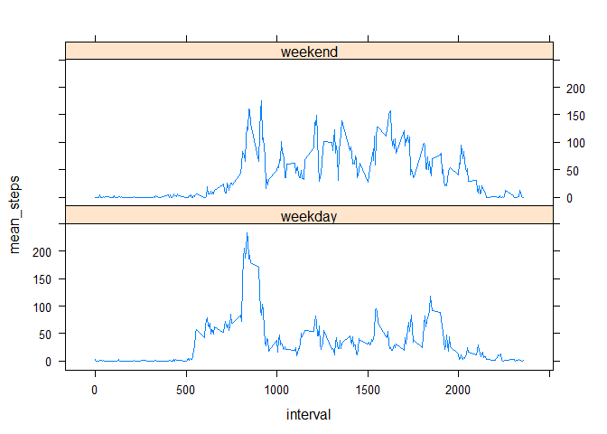

# Reproducible Research: Peer Assessment 1


## Loading and preprocessing the data


```r
data_raw <- read.table(unz("activity.zip", "activity.csv"), header=T, sep=",")
data_df <- tbl_df(data_raw)
data_analysis <-    data_df                                  %>% 
                    mutate(weekday= weekdays(as.Date(date))) %>%
                    group_by(date,weekday)                   %>% 
                    summarise(mean_steps = mean(steps), total_steps=sum(steps), missing=sum(is.na(steps)) )  
```

## What is mean total number of steps taken per day?

```r
histo        <- hist(data_analysis$total_steps, 
                     xlab='Number of steps', 
                     main ='Histogram of total steps per day')

sum_data    <- summary(data_analysis$total_steps)
median      <-sum_data['Median']
mean        <- round(sum_data['Mean'])
abline(v=mean,col="red")
abline(v=median,col="blue")
text(mean,max(histo$counts), paste("Mean =", mean) )
text(median,round(mean(histo$counts)), paste("Median =", median) )
```

 


## What is the average daily activity pattern?

```r
data_analysis2 <-     data_df                                                               %>% 
                      mutate(weekday=as.POSIXlt(as.Date(date))$wday )                       %>%
                      mutate(weekpattern = ifelse(weekday %in% c(0,6),'weekend','weekday')) %>%
                      group_by(interval, weekpattern)                                       %>% 
                      summarise(mean_steps=mean(steps, na.rm=T), missing=sum(is.na(steps)) )  

ymax <- maxValue <- max(data_analysis2$mean_steps)
xmax <- data_analysis2$interval[which(data_analysis2$mean_steps==maxValue)]
xyplot( mean_steps~interval, 
         data_analysis2, 
         type="l",
         panel = function(...) {
                 panel.abline(h=ymax, v=xmax, lty="dotted", col ="black")
                 panel.text(xmax,ymax, paste("Interval containing maxvalue:" ,xmax))
                 panel.xyplot(...)         
       })
```

 

## Imputing missing values

The number of missing data is : 2304 

There are some days fully missing, so the missing data is distributed only across days and not across time intervalls.

```r
filter(data_analysis, missing>0)
```

```
## Source: local data frame [8 x 5]
## Groups: date
## 
##         date    weekday mean_steps total_steps missing
## 1 2012-10-01     Montag         NA          NA     288
## 2 2012-10-08     Montag         NA          NA     288
## 3 2012-11-01 Donnerstag         NA          NA     288
## 4 2012-11-04    Sonntag         NA          NA     288
## 5 2012-11-09    Freitag         NA          NA     288
## 6 2012-11-10    Samstag         NA          NA     288
## 7 2012-11-14   Mittwoch         NA          NA     288
## 8 2012-11-30    Freitag         NA          NA     288
```

In a next step I am replacing the missing days with the respective mean values of these weekdays

```r
weekday_avg           <-       data_analysis      %>%
                               group_by(weekday)  %>%
                               summarise(avg = mean(total_steps, na.rm=T))

data_new             <-        merge(data_analysis,weekday_avg, by="weekday")
data_new$total_steps <-        ifelse(is.na(data_new$total_steps),
                                      data_new$avg,
                                      data_new$total_steps)

histo_new            <-        hist(data_new$total_steps, 
                                    xlab='Number of steps', 
                                    main ='Histogram of total steps per day with imputation for missings')

sum_data             <- summary(data_new$total_steps)
median_new               <- sum_data['Median']
mean_new                 <- round(sum_data['Mean'])

abline(v=mean_new,col="red")
abline(v=median_new,col="blue")
text(mean,max(histo$counts), paste("Mean =", mean_new) )
text(median,round(mean(histo$counts)), paste("Median =", median_new) )
```

 


The result shows that compared to the analysis without treating the missing values where the mean was 10800  the mean of total steps with imputation of missings with 10800 is the same!

The median compared to the analysis without treating the missing values where it was 10800  with imputation of missings the median becomes 11000  and is bigger!


## Are there differences in activity patterns between weekdays and weekends?

```r
data_analysis3 <-     data_df %>% 
  mutate(weekday=as.POSIXlt(as.Date(date))$wday ) %>%
  mutate(weekpattern = ifelse(weekday %in% c(0,6),'weekend','weekday')) %>%
  group_by(interval, weekpattern)                   %>% 
  summarise(mean_steps=mean(steps, na.rm=T), missing=sum(is.na(steps)) )  

xyplot(mean_steps~interval |weekpattern, data_analysis2, type="l", layout=c(1,2))
```

 


